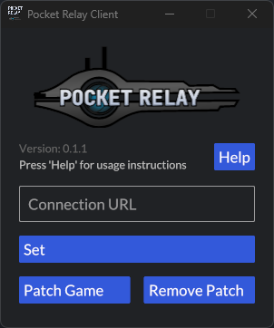
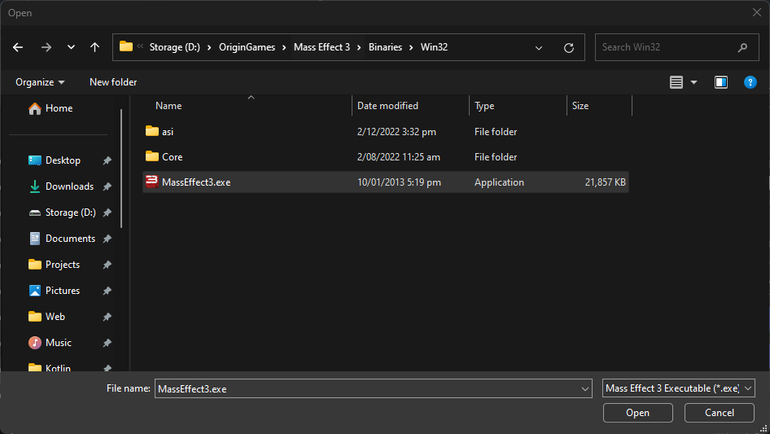
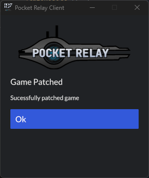
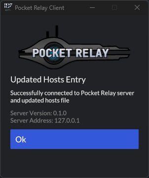

# Client Setup Guide

> This is a setup guide for connecting to Pocket Relay servers using the client application

In order for your client to be able to connect to Pocket Relay servers we will need to modify somes files and add some files to our game directory.

On Windows this can be done automatically with the client tool see the [[#Windows]] section

If you would like to manually make the required changes or are using linux with wine or some other application to run Mass Effect you can follow the [[#Manual]] section

## Windows

This section is for if you are using Windows and would like to use the Client tool to automatically setup your game to work with Pocket Relay

### 1) Download Client

- **Link to latest release**: https://github.com/PocketRelay/Client/latest

You can download the latest client release from [Here](https://github.com/PocketRelay/Client/releases/latest/download/pocket-relay-client.exe) . This application is portable and doesn't create any additional files outside of the game directory so you can place this executable wherever you like or just in your Downloads folder.

> Keep it somewhere you remember as you will need to use this tool to switch back to the official servers and to revert changes if you want to uninstall

### 2) Run Client

Next open the executable by Double Clicking it or Right Click + Run As Administrator

> 📌 Make sure you run the application as administrator. This should be the default automatically but if not make sure you run it as admin otherwise the application will not be able to update the files on its own

After the application starts up you will see the following screen or something similar to this (It may look slightly different in the future)



### 3) Patch Game

First you will need to patch your game to do this press the "Patch Game" button and the following file picker window will appear 



In this window naviagte to your Mass Effect 3 executable this will be in the game folder then Binaries/Win32/MassEffect3.exe. Select the executable file and press the "Open" button then if everything worked you will see the following screen back in the client



Press "Ok" to go back to the home screen

### 4) Connection URL

The server hoster will know this connection URL ask them to provide you with this. If you are the server hoster refer to step 4 "Connection URL" in the Server Setup Guide to find this value.

Enter this value into the text field named "Connection URL" then press the "Set" button

> Note: The server must be running when you press set otherwise the client will be unable to detect the server

If the client was able to successfully connect to the server you will get the following message



Press "Ok" to return to the home screen

### 5) All Done

Your game will now be able to connect to the Pocket Relay server that you've setup. When you first open the game. The client screen should now look like the following


Note: If the server IP address changes or you wish to connect to a different server 

>if you were already logged into the Official servers and are using a Cracked game client you will get a message saying connection failed simply press okay and then the multiplayer button again and you will be taken to a login prompt where you can create a new account

You can now close this client application as you do not need to keep it running

### 6) Official Servers

If you would like to switch back to the official servers while still keeping the patch you can do so by  only pressing "Remove" to remove the Pocket Relay server connection and if you restart your game you will connect back to the Official servers

### 7) Uninstalling

To uninstall Pocket relay open the client and select "Remove" to remove the redirect then "Remove Patch" to remove the Patch from the game.

>If you've followed the automatic install guide you do not need to continue reading you are finished.

##  Manual

This section is for manually setting up your Mass Effect 3 client and computer to work with Pocket Relay servers this tutorial is for both Windows and Linux

### 1) Add host file entry

First you must add a entry to the system hosts file in order to send the traffic that would normally go to the Official servers to the Pocket Relay server address

**Windows**:
Open Notepad as a Administrator and open the following file

```
C:/Windows/System32/drivers/etc/hosts
```

**Linux:**
Or If you are using linux. Use your desired text editor with sudo to modify the following file instead

```
/etc/hosts
```

Add the following line to the bottom of the hosts file

```
SERVER_IP_ADDRESS gosredirector.ea.com
```

But replace `SERVER_IP_ADDRESS` with the IP address of the Pocket Relay server you want to connect to

### 2) Patch Game

Download the dll files from https://github.com/Erik-JS/masseffect-binkw32 and copy both binkw32.dll and  binkw23.dll into your game folder in the same folder as MassEffect3.exe
